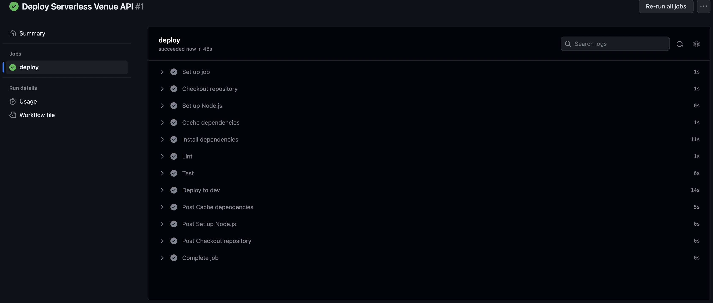

# Serverless Venue API

This API is designed to manage events and attendees for various types of events such as conferences, meetups, and concerts. The API allows you to create, update, delete, and retrieve event information, as well as manage attendees for each event.

## If I had more time I would:
- Add an authoriser to add some access control
- Add proper unit test coverage
- Add serverless-aws-documentation plugin and properly documented the routes
- Add some integration test coverage

## Table of Contents

- [Endpoints](#endpoints)
    - [Events](#events)
        - [Create Event](#create-event)
        - [Update Event](#update-event)
        - [Delete Event](#delete-event)
        - [Get Event](#get-event)
        - [Get All Events](#get-all-events)
    - [Attendees](#attendees)
        - [Create Attendee](#create-attendee)

## Endpoints

### Events

#### Create Event

- **Method**: `POST`
- **Path**: `/events`
- **Body**:

```json
{
  "name": "string",
  "description": "string",
  "startTime": "string (ISO 8601 date-time)",
  "endTime": "string (ISO 8601 date-time)",
  "category": "string (conference, meetup, concert)",
  "isDraft": "boolean",
  "isCancelled": "boolean"
}
```

#### Update Event

- **Method**: `PUT`
- **Path**: `/events/{eventId}`
- **Body**:

```json
{
  "id": "string",
  "name": "string",
  "description": "string",
  "startTime": "string (ISO 8601 date-time)",
  "endTime": "string (ISO 8601 date-time)",
  "category": "string (conference, meetup, concert)",
  "isDraft": "boolean",
  "isCancelled": "boolean"
}
```

#### Delete Event

- **Method**: `DELETE`
- **Path**: `/events/{eventId}`

#### Get Event

- **Method**: `GET`
- **Path**: `/events/{eventId}`

#### Get All Events

- **Method**: `GET`
- **Path**: `/events`

### Attendees

#### Create Attendee

- **Method**: `POST`
- **Path**: `/events/{eventId}/attendee`
- **Body**:

```json
{
  "name": "string",
  "email": "string",
  "eventId": "string"
}
```


## Example request

```bash
curl --location --request POST 'https://i0qfhuc8e9.execute-api.eu-west-2.amazonaws.com/dev/events' \
--header 'Content-Type: application/json' \
--data-raw '{
    "name": "Metallica Live",
    "description": "Some exciting description",
    "startTime": "2023-12-01T20:00:00Z",
    "endTime": "2023-12-01T23:00:00Z",
    "category": "concert",
    "isDraft": true,
    "isCancelled": false
}'
```

## Pipeline screenshot


